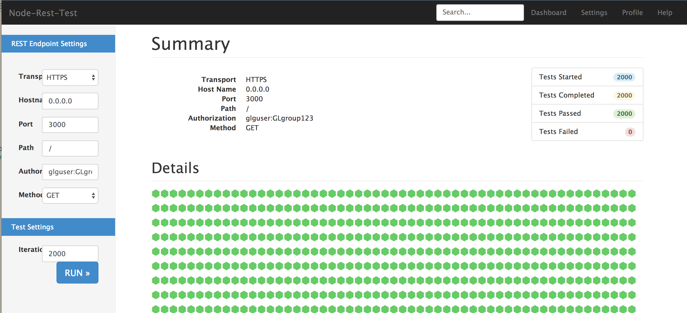

#Node-REST-Test

a quick and simple web app to load test a RESTful endpoint - using nodejs, angularjs and websockets.

## Usage

``` bash
npm install
npm start
```

Browse to http://localhost:3000


#References

http://jsfiddle.net/mqyCb/59/
http://jtauber.github.io/articles/css-hexagon.html
http://stackoverflow.com/questions/14702981/angularjs-model-changes-after-websocket-data-push-from-server
http://jsfiddle.net/HejjR/3/
http://book.mixu.net/node/ch6.html
